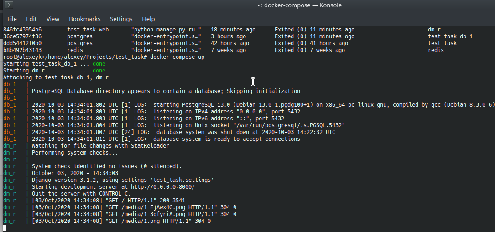
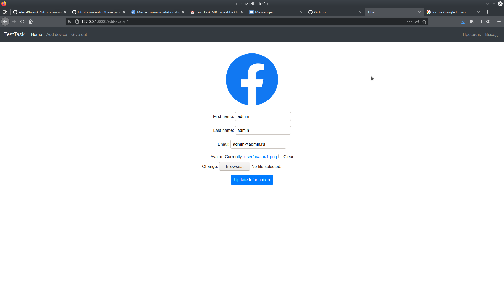
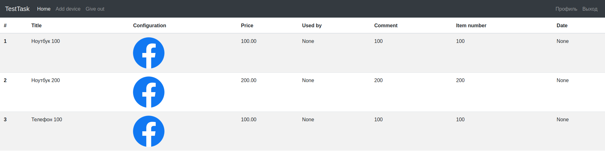
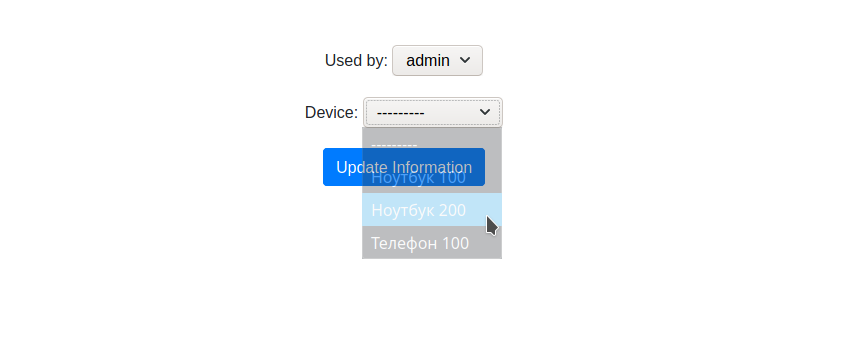
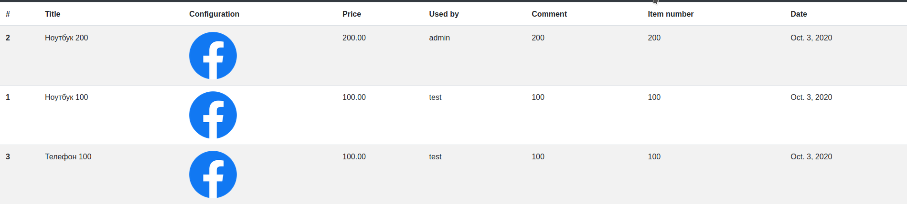
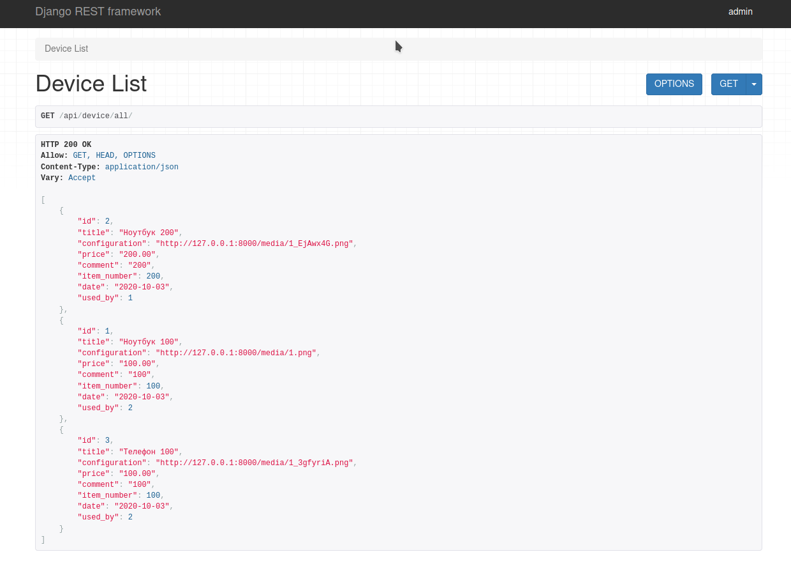

<h2 align="center">Test task</t></h2>

### Описание проекта:
Задание:
Создать приложение с возможностью выдавать технические средства сотруднику.

Пример действий:
- Добавить сотрудника
- Редактировать информацию о сотруднике
- Выдать Андрею ноутбук asus за 2000$
- Выдать Андрею наушники за 100$
- Выдать Джону монитор за 150$

**Tech Stack:**
- Django
- Django Rest Framework
- Postgres

Will be a plus:
- Docker
- tests

Note:
- Должно быть реализовано API
- У пользователя должна быть картинка
- У техники должна быть либо картинка либо ссылка на технику в интернете

